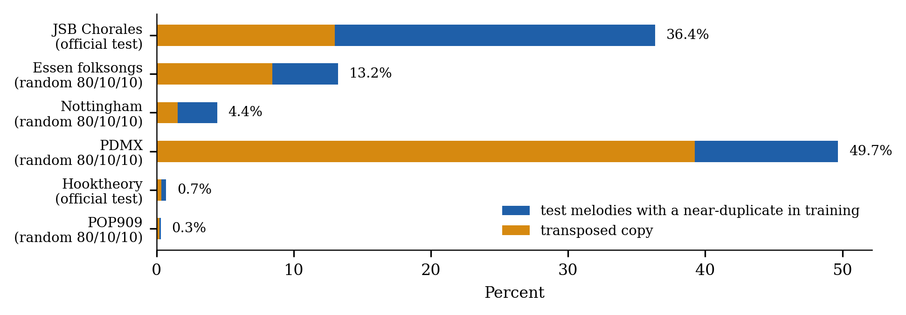
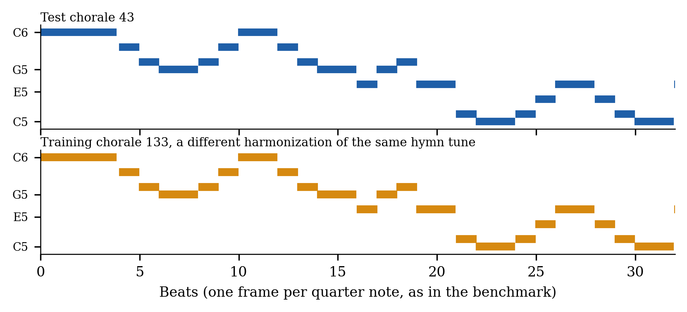
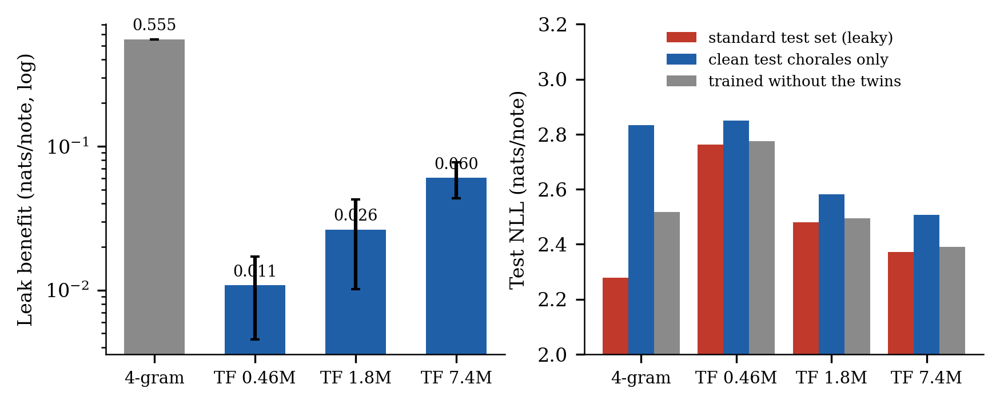
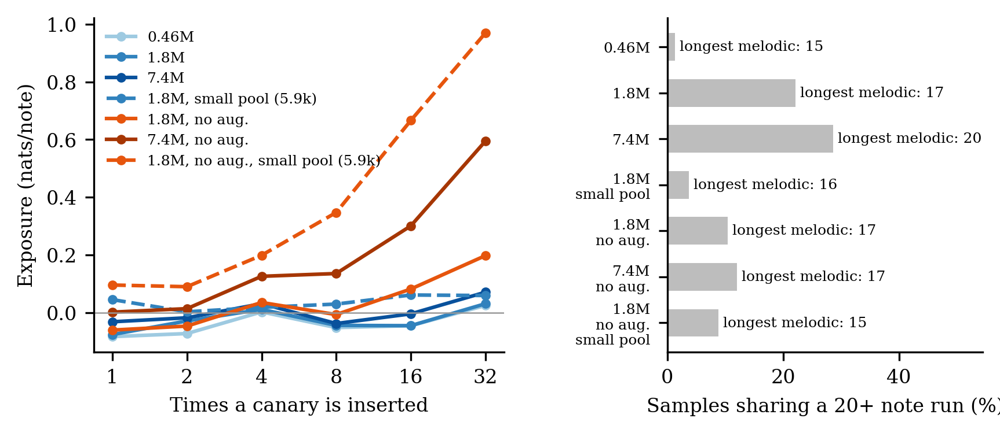

# Transposed Twins

**Benchmark leakage and memorization in symbolic melody models.**

Melody models are scored on how well they predict held-out tunes. But hymn tunes, folk tunes and pop songs exist in many versions, usually in different keys, so a "held-out" melody is often already in the training set under a transposition. This repo builds a transposition- and tempo-invariant twin detector, audits eight melody corpora and their standard splits, measures what the leaks are worth by retraining models without them, and tests whether melody language models copy their training data.

[Paper (PDF)](paper/transposed-twins.pdf) · [Listen to the twins](https://takakhoo.com/melodies) · [Twin lists and clean splits](release/) · Manuscript in preparation for TISMIR, *Open Music Data* special collection; not yet peer reviewed ([venue notes](notes/venue.md))



## Findings

**1. The JSB Chorales benchmark is 36% leaked at the melody level.** 28 of the 77 official test chorales sing a soprano that shares at least half its phrases with a training chorale; 10 are transposed copies. A four-voice fingerprint finds none of them, because Bach harmonized the same hymn tunes more than once and the split separated the settings. The official split leaks as much as a random split would (38.5%).



**2. PDMX is half near-duplicates.** 53.8% of its 220,902 public-domain melodies have a twin and 39.2% have a transposed copy. A random split would leak half the test set. Inside PDMX's own deduplicated subset, 6.2% of melodies still have a transposed copy.

| Corpus | Split | Test melodies with a twin in training | Transposed copy |
|---|---|---:|---:|
| JSB Chorales (soprano) | official | **36.4%** | 13.0% |
| PDMX | random 80/10/10 | **49.7%** | |
| Essen folksongs | random 80/10/10 | 13.2% | |
| Nottingham | official / random | 2.4% / 4.4% | |
| MuseData (top voice) | official | 2.4% | 0% |
| Hooktheory | official, split by artist | 0.7% | 0.35% |
| Piano-midi.de (top voice) | official | 0% | 0% |
| POP909 | random 80/10/10 | 0.3% | |

Hooktheory is the control: its artist-stratified split leaks a quarter of what a random split of the same data would (2.8%).

**3. The leak rewards copying and reverses a model ranking.** Every model is trained twice on JSB, with and without the 25 training chorales that twin a test chorale; the leak benefit is the difference in differences between leaked and clean test pieces.

| Model (soprano, 3 seeds) | Leak benefit (nats/note) | 95% CI |
|---|---:|---|
| 4-gram | **0.555** | [0.333, 0.784] |
| Transformer 0.46M | 0.011 | [0.001, 0.020] |
| Transformer 1.8M | 0.026 | [0.012, 0.042] |
| Transformer 7.4M | 0.060 | [0.039, 0.080] |

On the official test set the 4-gram scores 2.28 nats per note and beats every transformer (best 2.37). On the 49 clean test chorales the larger transformers beat it (2.51 against 2.83). Among transformers the benefit grows with size, so a leaked benchmark flatters exactly the larger models papers report as improvements. On full four-voice piano rolls, in the units of the published JSB results, the leak is worth 0.055 nats per frame at 0.11M parameters and 0.249 at 1.26M (3 seeds each); published models differ by similar amounts (TCN 8.10 vs LSTM 8.45).



**4. No verbatim memorization at melody-model scale, and the leak works anyway.** On PDMX, split by twin family, no model up to 7.4M parameters reproduces an inserted canary or a training melody. Transposition augmentation is the reason: switch it off and models prefer the canaries they saw, more with repetition and with size. See [Memorization](#memorization).

## Memorization

PDMX is split by twin family (no test melody has a relative in training). Each model trains on 30M tokens of either the raw training pool (29,208 melodies, duplicates kept) or the deduplicated one (18,089, one per family), both with 360 synthetic canaries inserted 1 to 32 times. Exposure is how much more likely the model finds canaries it saw 32 times than ones it never saw.

| Model | Train data | Augmentation | Test NLL | Exposure ×32 (nats/note) | Canaries extracted | Training melodies extracted | Samples with a ≥20-note shared run | Longest melodic shared passage |
|---|---|---|---:|---:|---:|---:|---:|---:|
| 0.46M | raw | yes | 2.636 | +0.03 | 0% | 0% | 1% | 15 notes |
| 1.8M | dedup | yes | 1.877 | +0.02 | 0% | 0% | 8% | 18 |
| 1.8M | raw | yes | 1.777 | +0.03 | 0% | 0% | 22% | 17 |
| 7.4M | dedup | yes | 1.521 | +0.09 | 0% | 0% | 24% | 19 |
| 7.4M | raw | yes | 1.507 | +0.07 | 0% | 0% | 29% | 20 |
| 1.8M | raw | **no** | 1.658 | **+0.20** | 0% | 0% | 10% | 17 |
| 7.4M | raw | **no** | 1.442 | **+0.59** | 0% | 0% | 12% | 17 |
| 1.8M | small raw pool, 13 passes | yes | 2.029 | +0.06 | 0% | 0.7% | 4% | 16 |
| 1.8M | small raw pool, 13 passes | **no** | 1.777 | **+0.97** | 0% | 0.7% | 9% | 15 |



- **No verbatim recall.** No model reproduces a canary or a training melody from its opening.
- **Transposition augmentation is what suppresses memorization.** With it, exposure stays near zero even after 400 views of a canary. Without it, models prefer seen canaries in proportion to repetition and model size, as language models do. On PDMX the augmentation also costs likelihood, because key is informative.
- **Copying in free samples is figuration.** The long runs samples share with training melodies are repeated notes, trills and looped arpeggios. The longest melodic passage any sample shares with a training tune is 15 to 20 notes.

So the transformers in the JSB counterfactual gain from leaked test melodies without storing them: a leak inflates a benchmark with no memorization you could catch by looking for copies. The strict copy search is [`experiments/14_copying.py`](experiments/14_copying.py).

## Reproduce

Python 3.13 on CPU. Every number in the paper comes from a numbered script in `experiments/`.

```bash
python -m venv .venv && source .venv/bin/activate
pip install -r requirements.txt
bash scripts/fetch_data.sh            # ~11 GB, SHA-256 checked; provenance in data/SOURCES.md
python -m pytest -q tests
python experiments/02_jsb_identify.py # JSB audit, exhaustive
python experiments/03_corpus_audit.py # all corpora
python experiments/07_jsb_soprano_extended.py  # counterfactual, soprano models
python experiments/04_jsb_counterfactual.py    # counterfactual, four voices
TRAIN_FRAC=0.15 TOKENS=30e6 python experiments/05_memorization.py XS S M
CORPORA=raw AUGMENT=0 TRAIN_FRAC=0.15 TOKENS=30e6 python experiments/05_memorization.py S M
CORPORA=raw TRAIN_FRAC=0.03 TOKENS=30e6 python experiments/05_memorization.py S   # small pool; repeat with AUGMENT=0
python experiments/14_copying.py
python experiments/09_figures.py && python experiments/13_memorization_report.py
```

| Script | What it does |
|---|---|
| `01_benchmark_leakage_first_look.py` | MinHash pass over the four piano-roll benchmarks (top voice and all voices) |
| `02_jsb_identify.py` | Exhaustive JSB test/valid vs train comparison; hymn-tune identification against the music21 Bach corpus |
| `03_corpus_audit.py` | Twin graph, families and 200 random splits per corpus; PDMX dedup-subset check |
| `04_jsb_counterfactual.py` | Retraining counterfactual on four-voice piano rolls |
| `06/07_jsb_soprano_*.py` | Retraining counterfactual on soprano lines: 4-gram and three transformer sizes |
| `05_memorization.py` | PDMX family split, raw vs dedup corpora, canaries, extraction, free-sample copy search |
| `10_lsh_recall.py` | Recall of the MinHash stage against exhaustive comparison (0.986 on JSB, 1.0 on Nottingham) |
| `11_jsb_graph.py` | JSB twin graph and random-split baseline |
| `12_release.py` | Twin lists and family-level splits in `release/` |
| `13_memorization_report.py` | Memorization table and figure |
| `14_copying.py` | Strict copy search in free samples; listening examples for the site |

## Released files

- `release/twins/<corpus>.csv` (PDMX files gzipped): every twin pair with Jaccard score, longest common run and transposition. Essen pairs are identifiers only; its licence forbids redistributing the melodies.
- `release/splits/jsb_clean_test.txt`: the 49 JSB test chorales with no twin in training. Report this number next to the standard one.
- `release/splits/*_family_split.json`: 80/10/10 splits that keep each twin family on one side (JSB, Nottingham, PDMX). No test melody has a twin in training.

## How the detector works

Each note becomes a pair (pitch interval to the previous note, quantized ratio of successive inter-onset intervals), which ignores key and tempo. Melodies are shingled into 8-symbol phrases, MinHash with 32 bands of 4 rows proposes candidates, and every candidate is verified exactly by shingle Jaccard and longest common run. A twin shares half its phrases or 12 consecutive symbols; a transposed copy has Jaccard of at least 0.9. Code in [`src/melody/dedup.py`](src/melody/dedup.py) and [`src/melody/representation.py`](src/melody/representation.py).

## Data and licences

Code is MIT. Corpora are not redistributed; `scripts/fetch_data.sh` downloads them from their pinned sources. PDMX scores are public domain or CC0. Essen is CCARH-licensed (no redistribution). Hooktheory is CC BY-NC-SA 3.0. The Session and IrishMAN are excluded on purpose: The Session's licence forbids processing its tunes with language-model tools.

## History

This repository started in September 2025 as a small TensorFlow next-note transformer trained on six melodies, whose one honest result was that the model memorized its training tunes and lost to a bigram on a held-out one. That code lives in [`legacy/`](legacy/). The research here takes the same question, memorization against generalization, to real corpora and real benchmarks.

## Citation

```bibtex
@misc{khoo2026twins,
  title  = {Transposed Twins: Benchmark Leakage and Memorization in Symbolic Melody Models},
  author = {Khoo, Taka},
  year   = {2026},
  note   = {Manuscript in preparation for TISMIR},
  url    = {https://github.com/takakhoo/transformer-melody-generation}
}
```
